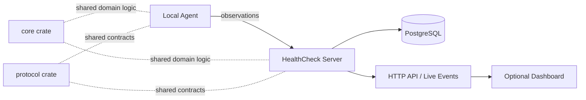

# HealthCheck

HealthCheck is planned as a distributed monitoring platform for remote services, local processes, and service dependency chains. The project is intended to explore reliable monitoring, agent/server communication, dependency-aware incident modeling, and root-cause-oriented health visualization.

This repository currently contains the initial project foundation and the first shared core domain types. Monitoring behavior has not been implemented yet.

## Goals

- Monitor remote services and local systems from a central server and deployable agents.
- Model dependency chains so downstream failures can be separated from likely root causes.
- Demonstrate Rust systems programming with asynchronous networking, persistence, and clear domain boundaries.
- Keep the architecture simple enough for a portfolio project while leaving room for production-realistic concerns.

## Planned Features

- Remote HTTP checks.
- TCP checks.
- DNS checks.
- TLS and certificate checks.
- Local process and service monitoring.
- CPU, memory, and process metrics from local agents.
- Configurable polling intervals.
- Health history and incident tracking.
- Dependency graphs between services and checks.
- Dependency-aware failure visualization.
- Server-sent events or WebSockets for live updates where appropriate.
- Optional web dashboard after the core backend is established.

## Architecture

The intended architecture is a central server that stores checks, receives observations, evaluates health state, and exposes APIs. Lightweight agents will run near monitored workloads and report local process, service, and system metrics. Shared domain logic belongs in `core`, while communication contracts belong in `protocol`.

## Repository Structure

- `crates/server` - planned central API, persistence, scheduling, and incident evaluation service.
- `crates/agent` - planned lightweight deployable monitor for local processes and system metrics.
- `crates/core` - shared domain types for projects, services, checks, health status, and check results.
- `crates/protocol` - planned server/agent communication structures.
- `migrations` - future SQLx database migrations.
- `config/examples` - example configuration files once configuration is introduced.
- `docs` - architecture and protocol notes.
- `scripts` - future developer and operational scripts.
- `tests` - integration and system-level tests.

## Technology Stack

- Rust - primary language.
- Tokio - planned asynchronous runtime.
- Axum - planned HTTP server framework.
- SQLx - planned database access layer.
- PostgreSQL - planned persistence layer.
- Server-sent events or WebSockets - planned live event transport.

Only the Rust workspace structure and initial core domain model are currently present.

## Development

Setup instructions will be expanded as implementation begins. No dependencies beyond the initial Rust workspace skeleton are required yet.

## Roadmap

- [ ] Define core health-check and incident domain models. Initial health-check domain types are in place; incident modeling is still pending.
- [ ] Establish server configuration and persistence migrations.
- [ ] Implement basic remote HTTP checks.
- [ ] Add agent registration and observation ingestion.
- [ ] Add local process and system monitoring.
- [ ] Model service dependencies and incident propagation.
- [ ] Add live health updates for clients.
- [ ] Expand integration and failure-mode tests.

## License

MIT. See `LICENSE`.

HealthCheck is under active development.
